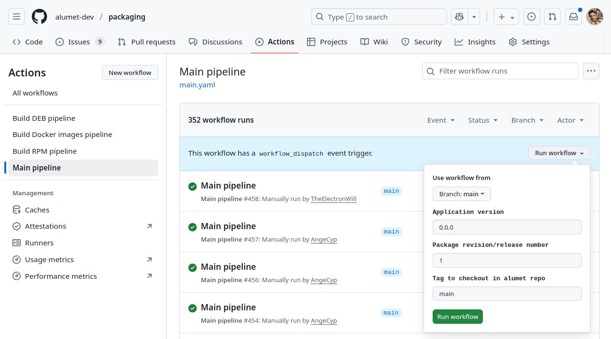

# Workflow usage

## About version numbers

Version numbers are "normalized" by the workflows.
In particular, hyphens `-` are replaced with tildes `~` so that a version number like `0.8.0-d89b24f` is turned into `0.8.0~d89b24f`, which is considered to be OLDER than `0.8.0`.

## Workflows

### [build_rpm.yaml](./.github/workflows/build_rpm.yaml)

Builds an RPM package.

Example:

```yaml
jobs:
  rpm:
    uses: ./.github/workflows/build_rpm.yaml
    with:
      arch: x86_64
      version: 0.6.1
      release-version: 1
      tag: v0.6.1
```

When compiled for fedora 40 for x86_64 architecture, with this input, the resulting package will be `alumet-agent-0.6.1-1.fc40.x86_64.rpm`.

### [build_deb.yaml](./.github/workflows/build_deb.yaml)

Builds a DEB package.

Example:

```yaml
jobs:
  deb:
    uses: ./.github/workflows/build_deb.yaml
    with:
      arch: amd64
      version: 0.6.1
      revision: 1
      tag: v0.6.1
```

Warning:

- When building a DEB package, you must not set arch to `x86_64` but to `amd64`.
- Debian's terminology uses `revision` instead of `release version`. This is reflected in the workflow's parameters.

### [build_docker.yaml](./.github/workflows/build_docker.yaml)

Builds multiple Docker images.

Example:

```yaml
jobs:
  docker:
    uses: ./.github/workflows/build_docker.yaml
    with:
      arch: x86_64
      version: 0.6.1
      release-version: 1
      tag: v0.6.1
```

This workflow builds multiple images, with different base operating systems.
When the architecture is set to `x86_64`, the workflow will replace it by `amd64` for DEB packages (and only for them).
In the parameters of the docker workflow, you must never set the arch to `amd64`.

## Manually Running the Workflows on GitHub

If you have access to the `packaging` repository, you can run the workflows from the web UI.
Go to the **Actions** tab, select a workflow that can be triggered manually, such as "main pipeline", and click on **run workflow**.


